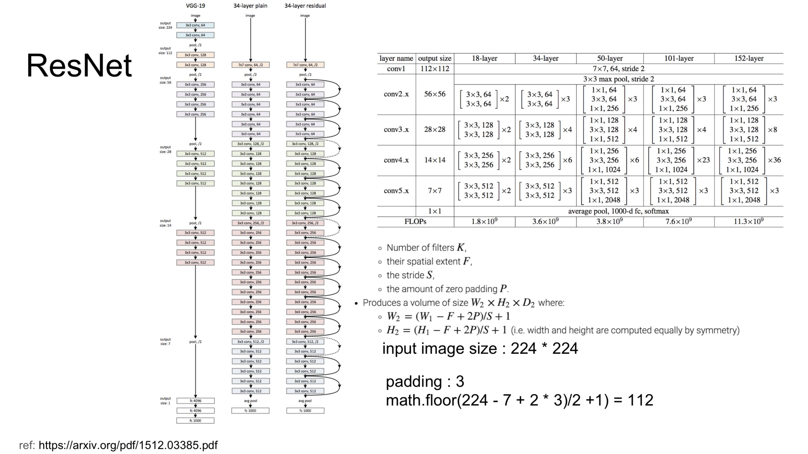

# 소프트웨어마에스트로 9기 머신러닝 과제

## 내용

python 기반 머신러닝 pytorch를 학습한다.
pytorch를 활용해 ResNet18 기반의 이미지 비교 샘플을 기반으로 모델을 변경해 성능을 높힌다.

### 개발환경

* Host : MacOS 10.13.x
* Docker : Docker-edge
* Container : Jupyter Notebook

<pre>
docker pull namsangboy/pytorch-img-retrieval
docker run -it --name=pytorch-img-retrieval -p 30020-30030:30020-30030 namsangboy/pytorch-img-retrieval /bin/bash
cd /app/workspace;jupyter-notebook --ip=0.0.0.0 --port=30020
</pre>

### 수행내용
1. ResNet18 -> ResNet152로 변경
2. ResNet152 -> SEResNet152로 변경
3. PreTained Dataset 활용

### Reference
* [Pytorch](https://pytorch.org/docs/stable/index.html)
* [Pytorch-model](https://pytorch.org/docs/stable/torchvision/models.html?highlight=model)

